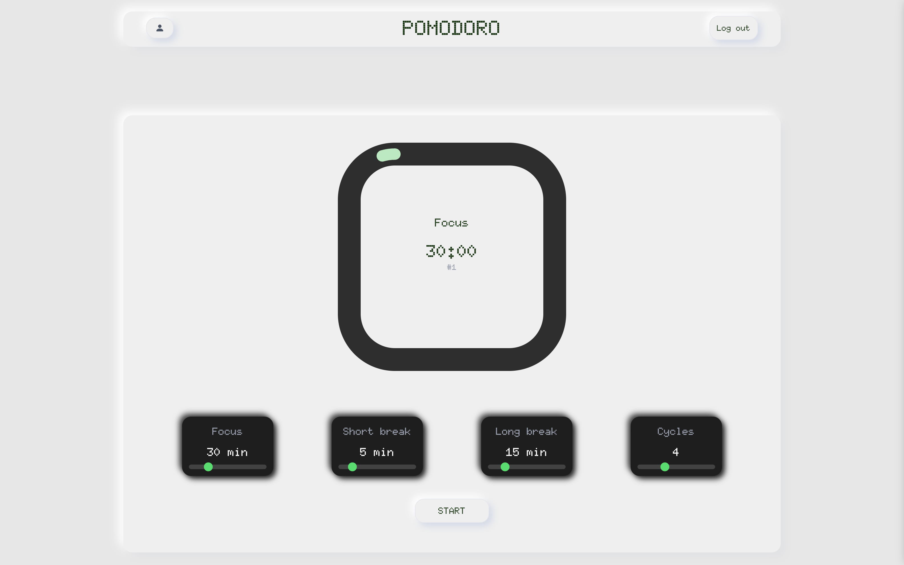

  
  <h1>Pomodoro</h1>
  
  
  
  
  
  
  

  

## 📝 Description

Application de gestion du temps moderne et intuitive basée sur la technique Pomodoro. Conçue pour maximiser la productivité tout en maintenant un équilibre sain entre travail et pauses.

### 🎯 Fonctionnalités Principales

- ⏱️ Minuteur Pomodoro personnalisable
- 🔄 Synchronisation multi-appareils
- 🎯 Suivi de progression

### 🚧 En Développement

- 📱 Application mobile
- 🔔 Notifications
- 📊 Suivi des sessions et statistiques

## 🛠️ Technologies Utilisées

### 🔧 API

- Symfony 7.2
- PHP 8.2+
- API Platform
- JWT Authentication
- OAuth2
- Mercure

### 🌐 App web

- Next.js 15.2
- React 19
- TypeScript
- Tailwind CSS
- Shadcn/ui
- Next-Auth
- Next-intl (Internationalisation)

---

Développé par Théo Sourisseau

